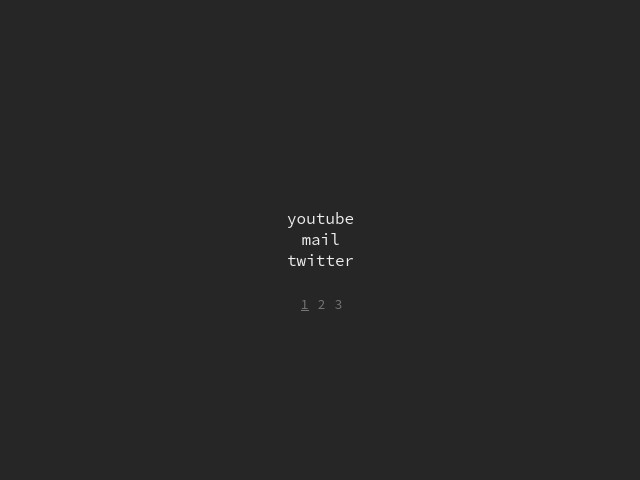

# myn-startpage
a customizable minimalist browser start page

## preview

## configuration
myn is simple to configure.

all editting should be done to the pages.js file, which
contains all the customizable variables.

### font & colors
the first few are simple; font changes the page's font-family,
the background_color changes the main color of the page,
and the foreground_color and alt_foreground_color affect the
text color of the links and navigation buttons respectively.

### the pages array
the pages array is a multidimensional array that contains all
the links you want in the start page. each array element of the
pages array contains a multitude of 'link' objects, which themselves
each have 'title' and 'link' strings.

the page will automatically adapt to the number of arrays and objects,
so as long as the pages array is configured properly, the webpage
should react in turn.
